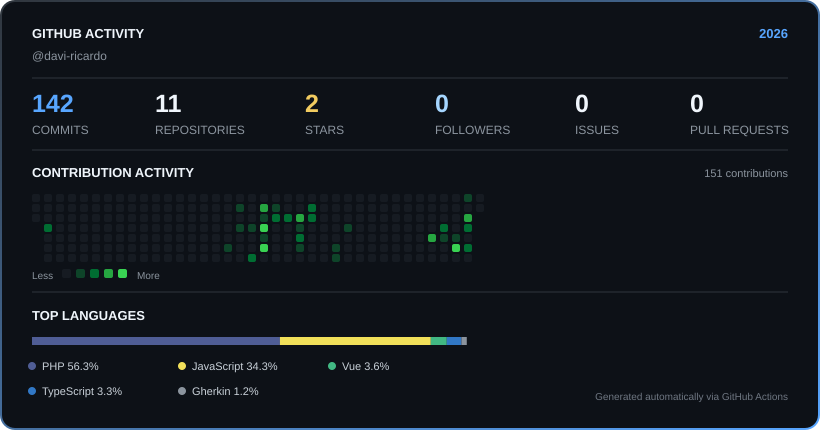

# Davi Ricardo

### Infrastructure • Linux • DevOps • Automation

**Analista de TI · Estudante de Ciência da Computação**

 

---

## 👋 About Me

Sou **Analista de TI** e estudante de **Ciência da Computação**, com foco em infraestrutura, administração Linux, containers, Kubernetes, observabilidade e automação.

Meu trabalho combina **operação de ambientes reais com desenvolvimento de ferramentas próprias**, buscando transformar problemas de infraestrutura em soluções reproduzíveis, monitoráveis e automatizadas.

Atualmente venho aprofundando meus conhecimentos em **Linux, Docker, Kubernetes/K3s, networking, monitoramento, automação e desenvolvimento de aplicações**, utilizando projetos próprios como laboratório prático.

---

## 🧩 Core Competencies

<table>
<tr>
<td width="50%" valign="top">

### 🖥️ Infrastructure

- Administração Linux
- VPS e servidores
- SSH
- Networking
- Troubleshooting
- Docker
- Docker Compose
- Kubernetes / K3s
- Portainer
- Self-hosting

</td>

<td width="50%" valign="top">

### ⚙️ Operations

- Deployment de aplicações
- Gerenciamento de serviços
- Administração remota
- Logs e troubleshooting
- Automação
- Integração de serviços
- Versionamento de infraestrutura
- ITSM
- Ambientes containerizados

</td>
</tr>

<tr>
<td width="50%" valign="top">

### 📊 Observability

- Zabbix
- Grafana
- Métricas
- Dashboards
- Alertas
- Monitoramento de infraestrutura
- Integração de ferramentas
- Indicadores operacionais

</td>

<td width="50%" valign="top">

### 💻 Development

- JavaScript
- React
- Python
- PostgreSQL
- MariaDB
- APIs
- Aplicações web
- n8n
- Git & GitHub

</td>
</tr>
</table>

---

# 🛠️ Technology Stack

### Infrastructure & Platforms

### Development & Databases

### Automation & Observability

### Version Control

---

# 🚀 Featured Projects

## ☸️ K3s Cluster Infrastructure

**Kubernetes infrastructure laboratory focused on practical administration, deployment and observability.**

Este projeto representa meu ambiente principal de estudo e prática com Kubernetes, utilizando **K3s** para executar e administrar aplicações reais em um cluster versionado.

### Focus

- Kubernetes / K3s
- Pods
- Deployments
- ReplicaSets
- Services
- Namespaces
- ConfigMaps
- Secrets
- Labels & Selectors
- Kubernetes YAML
- Networking
- Container workloads
- PostgreSQL
- MariaDB
- Portainer
- Git versioning

### Infrastructure Flow

<pre>
                         ┌─────────────────────┐
                         │     K3s Cluster     │
                         │      Kubernetes     │
                         └──────────┬──────────┘
                                    │
               ┌────────────────────┼────────────────────┐
               │                    │                    │
        ┌──────▼──────┐      ┌──────▼──────┐      ┌──────▼──────┐
        │     GLPI    │      │   Grafana   │      │   Zabbix    │
        │     ITSM    │      │Observability│      │  Monitoring │
        └─────────────┘      └─────────────┘      └─────────────┘
               │                    │                    │
               └────────────────────┼────────────────────┘
                                    │
                             ┌──────▼──────┐
                             │  RemoteOps  │
                             │   Services  │
                             └─────────────┘
</pre>

🔗 **Repository:** [k3s-cluster-infrastructure](https://github.com/davi-ricardo/k3s-cluster-infrastructure)

---

## 🖥️ RemoteOps

Plataforma própria voltada para **gerenciamento remoto e operações de infraestrutura**.

O projeto combina desenvolvimento de aplicações com infraestrutura de serviços, buscando centralizar recursos relacionados à administração de ambientes remotos.

### Stack

`React` · `JavaScript` · `Docker` · `PostgreSQL` · `RustDesk`

---

## 📊 Monitoring & Observability

Ambiente de monitoramento baseado na integração entre **Zabbix, Grafana e GLPI**, conectado aos serviços e aplicações executados na infraestrutura.

### Operational Flow

<pre>
┌─────────────┐
│   Zabbix    │
│  Detection  │
└──────┬──────┘
       │
       ▼
┌─────────────┐
│   Grafana   │
│Visualization│
└──────┬──────┘
       │
       ▼
┌─────────────┐
│    GLPI     │
│     ITSM    │
└──────┬──────┘
       │
       ▼
┌─────────────┐
│  Operations │
│  & Support  │
└─────────────┘
</pre>

### Operational Model

**Detect → Visualize → Register → Resolve**

O objetivo é conectar **monitoramento, observabilidade, gestão de incidentes e operações de suporte** em um fluxo integrado.

---

# 🏠 Self-hosted Infrastructure

Também trabalho com ambientes **self-hosted**, utilizando servidores Linux e containers para executar e integrar diferentes serviços.

| Service | Purpose |
|---|---|
| **Nextcloud** | File synchronization & collaboration |
| **RustDesk** | Remote access |
| **GLPI** | ITSM & asset management |
| **Zabbix** | Infrastructure monitoring |
| **Grafana** | Dashboards & observability |
| **n8n** | Automation & integrations |
| **PostgreSQL** | Relational database |
| **MariaDB** | Relational database |
| **Docker** | Containerization |
| **K3s** | Kubernetes orchestration |

---

# 🏗️ Engineering Approach

Meu objetivo não é apenas fazer uma aplicação funcionar.

Procuro construir ambientes que sejam:

<pre>
                     ┌───────────────────┐
                     │    Application    │
                     └─────────┬─────────┘
                               │
                     ┌─────────▼─────────┐
                     │  Infrastructure   │
                     └─────────┬─────────┘
                               │
             ┌─────────────────┼─────────────────┐
             │                 │                 │
       ┌─────▼─────┐     ┌─────▼─────┐     ┌─────▼─────┐
       │ Automation │     │ Monitoring │     │ Versioning│
       └───────────┘     └────────────┘     └───────────┘
</pre>

### Principles

- **Reproducibility**
- **Observability**
- **Automation**
- **Version Control**
- **Documentation**
- **Troubleshooting**
- **Security**
- **Maintainability**

---

# 📚 Current Focus

| Area | Focus |
|---|---|
| 🐧 **Linux** | Administração, serviços e troubleshooting |
| 🐳 **Docker** | Containers, networks, volumes e Compose |
| ☸️ **Kubernetes** | Administração prática com K3s |
| 📊 **Observability** | Zabbix, Grafana, métricas e alertas |
| ⚙️ **Automation** | n8n e integração de serviços |
| 🗄️ **Databases** | PostgreSQL e MariaDB |
| 💻 **Development** | React, JavaScript e Python |
| 🌐 **Networking** | Comunicação entre serviços e troubleshooting |
| 🔧 **Operations** | Deploy, manutenção e administração |

---

# 📊 GitHub Overview

---

# 🐍 Contribution Graph

---

# 🎯 Professional Direction

Meu objetivo é evoluir profissionalmente na interseção entre:

<pre>
Linux
  │
  ▼
Infrastructure
  │
  ▼
Containers
  │
  ▼
Kubernetes
  │
  ▼
Automation
  │
  ▼
Observability
  │
  ▼
DevOps
</pre>

Busco desenvolver uma carreira baseada em **infraestrutura, operações, automação e DevOps**, utilizando projetos reais como laboratório para transformar conhecimento teórico em experiência prática.

---

## Let's build better infrastructure.

 

  

Infrastructure · Automation · Observability · Engineering

